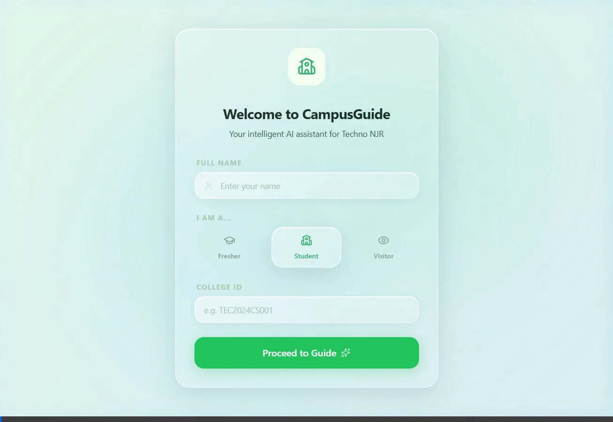

<div align="center">
<h1>🚀 CampusGuide AI</h1>
  
  <p><strong>An ultra-modern, high-tech AI platform designed to seamlessly navigate campus resources.</strong></p>

  <p>
    
    
    
    
    
  </p>
</div>

---

## 🌟 Overview

**CampusGuide** is a state-of-the-art AI chatbot interface built to help students effortlessly navigate their university life. From finding the library's operational hours to checking out the latest upcoming events, CampusGuide utilizes cutting-edge Large Language Models (LLMs) to provide real-time, context-aware, and highly accurate responses. 

Step into the future of education management with our sleek, glassmorphism-inspired interface featuring seamless Light and Dark themes, and lightning-fast search capabilities powered by a dedicated knowledge base.

---

## 🎥 Demonstration Interface

Experience the speed and intelligence of CampusGuide in action:

<div align="center">
  
</div>

---

## ✨ Cutting-Edge Features

- **🧠 Intelligent AI Avatar:** Context-aware conversations powered by the latest Groq/Llama LLM capabilities.
- **🗺️ Interactive Data Retrieval:** Instantly lookup Facilities, Clubs, Upcoming Events, and Admission rules.
- **🎨 Premium Light & Dark Mode UI:** Award-winning UX/UI featuring seamless theme switching. Glowing neon accents, sophisticated glassmorphism, and buttery smooth Framer Motion animations.
- **⚡ Blazing Fast Architecture:** Built on Vite React and powered by an optimized Express and SQLite backend for zero-latency queries.
- **🖼️ Multimodal Support:** Send both text and images to the CampusBrain for contextual assistance.
- **💾 Local Knowledge Graph:** Robust `better-sqlite3` database pre-loaded with comprehensive campus information extending search via intelligent keyword mapping.

---

## 🛠️ Tech Stack

| Layer | Technology |
| --- | --- |
| **Frontend** | React 19, Vite, Tailwind CSS v4, Framer Motion, Lucide React Icons |
| **Backend** | Node.js, Express.js |
| **Database** | SQLite (via `better-sqlite3`) |
| **AI Integration** | Groq API (Llama models), Google Gen AI SDK |

---

## 🚀 Run Locally

Experience it on your own machine.

### Prerequisites:
- **Node.js** (v18+ recommended)
- **API Keys** for Groq / Gemini

### Installation

1. **Clone & Install Dependencies**
   ```bash
   npm install
   ```

2. **Configure Environment variables**
   Create a `.env` file (or update `.env.local`) and add your API keys:
   ```env
   GROQ_API_KEY=your_groq_api_key_here
   GEMINI_API_KEY=your_gemini_api_key_here
   ```

3. **Launch the Engine**
   Fire up the backend and frontend simultaneously:
   ```bash
   npm run dev
   ```
   > 🔗 *The application will instantly boot up at [http://localhost:5000](http://localhost:5000)*

---
<p align="center">
  <i>Built with ❤️ for the students of tomorrow.</i>
</p>
